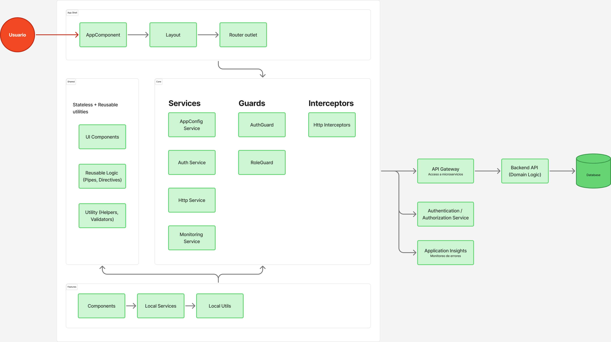
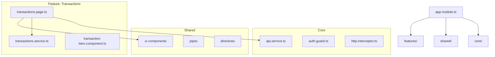

# Introduction

**📖 [English](./README.md) | [Español](../es/README.md)**

This document describes the project architecture, including its key decisions, main components, internal structures, and C4 diagrams.

The goal is to provide a clear reference for current and future developers, facilitate onboarding, and improve system maintainability.

# Architectural Objectives

- Maintain a modular, scalable, and easy-to-maintain architecture.
- Separate responsibilities into layers (Core, Shared, Features, App Shell) following separation of concerns principles.
- Ensure that communication with APIs and external services is centralized.
- Maintain a consistent design based on documented development rules.
- Allow incorporation of new features without affecting existing ones.
- Follow the [official Angular Style Guide](https://angular.dev/style-guide) to maintain code consistency.
- Use Tailwind CSS for utilities and maintain BEM with `ft-` prefix for component styles.
- Establish clear rules for AI-assisted development that ensure consistent application of architectural decisions.

# Scope

This document describes the frontend architecture, including:

- Angular project structure  
- Internal layers (Core, Shared, Feature Modules)  
- API communication  
- Internal libraries  
- C4 diagrams

# Architecture Overview

The project is based on Angular, structured through functional modules and folders that separate responsibilities.

The architecture follows the C4 Model, which describes the system from highest to lowest level of detail.

# C4 Level 3 – Component Diagram (Frontend)

This diagram shows the main internal components of the system and how they interact with each other.

# C4 Level 4 – Internal Modules and Classes Diagram

This section details the actual internal code structure, useful for developers.

You can show:

- Folder hierarchy  
- Internal components  
- Services  
- Interfaces  
- Inter-module communication  

# Architectural Decisions (ADRs)

This project follows the Architectural Decision Records (ADR) format to document key architectural decisions. Each ADR is maintained as a separate document in the [`adr/`](./adr/) directory.

## ADR Index

- **[ADR-001: Separation of Responsibilities - Core, Shared, and Features](./adr/ADR-001.md)**  
  Defines the three-layer architecture (Core, Shared, Features) with clear dependency rules and separation of concerns.

- **[ADR-002: Adoption of the Official Angular Style Guide](./adr/ADR-002.md)**  
  Establishes adherence to the official Angular Style Guide for consistent code patterns and best practices.

- **[ADR-003: Use of Tailwind CSS for Utility Classes and Component Creation](./adr/ADR-003.md)**  
  Mandates Tailwind CSS for utility classes while reserving custom CSS with `ft-` prefix for component-specific styles following BEM.

- **[ADR-004: AI-Assisted Development Rules](./adr/ADR-004.md)**  
  Documents rules for AI-assisted development to ensure consistent code generation aligned with architectural decisions.

- **[ADR-005: Internationalization (i18n) Strategy](./adr/ADR-005.md)**  
  Defines the internationalization strategy using Angular i18n with runtime translation loading and automated translation management.

- **[ADR-006: Repository Pattern for REST Services](./adr/ADR-006.md)**  
  Establishes the repository pattern with `getMutations()` and `getResource()` for standardized REST API communication and state management.

- **[ADR-007: Testing Strategy](./adr/ADR-007.md)**  
  Defines the testing approach using Vitest for unit/integration tests and Playwright for E2E tests, following AAA pattern and coverage goals.

- **[ADR-008: Form Validation Strategy](./adr/ADR-008.md)**  
  Standardizes form validation using Reactive Forms with errorMessage pipe, validator hierarchy, and consistent error display patterns.

- **[ADR-009: Code Quality & Tooling](./adr/ADR-009.md)**  
  Documents the code quality toolchain including ESLint, Prettier, Husky, Commitlint, and automated quality enforcement.

- **[ADR-010: Icon Usage Strategy](./adr/ADR-010.md)**  
  Defines the icon usage strategy using a unified `<ft-icon />` component with support for predefined collections and custom icons.

- **[ADR-011: Documentation Strategy](./adr/ADR-011.md)**  
  Establishes documentation standards requiring English-only documentation, JSDoc/TSDoc format, and Compodoc for automatic API documentation generation.

## Creating New ADRs

When making significant architectural decisions, create a new ADR following this template:

1. Create a new file: `docs/adr/ADR-XXX.md`
2. Follow the ADR format with sections: Context, Decision, Consequences
3. Include examples and code snippets where relevant
4. Update this index with a link to the new ADR
5. Reference the ADR in relevant documentation

For more information about ADRs, see [ADR GitHub](https://github.com/joelparkerhenderson/architecture-decision-record).

# Security and Privacy

- Data sanitization  
- JWT authentication (if applicable)  
- Route guards  
- Mandatory HTTPS  

# Performance and Optimization

- Module lazy loading  
- OnPush change detection  
- Service caching  

# Conclusions

This document establishes the base structure and dependencies of the project, serving as a guide to maintain code coherence and facilitate system scaling.
