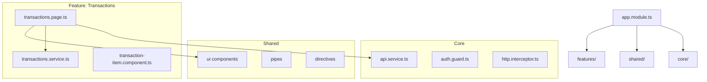

# Introducción

**📖 [English](../en/README.md) | [Español](./README.md)**

Este documento describe la arquitectura del proyecto, incluyendo sus decisiones clave, componentes principales, estructuras internas y diagramas C4.

El objetivo es proporcionar una referencia clara para desarrolladores actuales y futuros, facilitar el onboarding y mejorar la mantenibilidad del sistema.

# Objetivos Arquitectónicos

- Mantener una arquitectura modular, escalable y fácil de mantener.
- Separar responsabilidades en capas (Core, Shared, Features, App Shell) siguiendo principios de separación de responsabilidades.
- Asegurar que la comunicación con APIs y servicios externos esté centralizada.
- Mantener un diseño consistente basado en reglas de desarrollo documentadas.
- Permitir incorporación de nuevas funcionalidades sin afectar las existentes.
- Seguir la [guía de estilo oficial de Angular](https://angular.dev/style-guide) para mantener consistencia en el código.
- Utilizar Tailwind CSS para utilidades y mantener BEM con prefijo `ft-` para estilos de componentes.
- Establecer reglas claras para desarrollo asistido por IA que garanticen la aplicación consistente de las decisiones arquitectónicas.

# Alcance

Este documento describe la arquitectura del frontend, incluyendo:

- Estructura del proyecto Angular  
- Capas internas (Core, Shared, Feature Modules)  
- Comunicación con APIs  
- Librerías internas  
- Diagramas C4

# Visión General de la Arquitectura

El proyecto está basado en Angular, estructurado mediante módulos funcionales y carpetas que separan responsabilidades.

La arquitectura sigue el C4 Model, que describe el sistema desde mayor a menor nivel de detalle.

# C4 Level 3 – Diagrama de Componentes (Frontend)

Este diagrama muestra los principales componentes internos del sistema y cómo interactúan entre sí.

# C4 Level 4 – Diagrama Interno de Módulos y Clases

Esta sección detalla la estructura interna real del código, útil para desarrolladores.

Puedes mostrar:

- Jerarquía de carpetas  
- Componentes internos  
- Servicios  
- Interfaces  
- Comunicación entre módulos  

# Decisiones Arquitectónicas (ADRs)

Este proyecto sigue el formato de Architectural Decision Records (ADR) para documentar decisiones arquitectónicas clave. Cada ADR se mantiene como un documento separado en el directorio [`adr/`](./adr/).

## Índice de ADRs

- **[ADR-001: Separación de Responsabilidades - Core, Shared y Features](./adr/ADR-001.md)**  
  Define la arquitectura de tres capas (Core, Shared, Features) con reglas de dependencia claras y separación de concerns.

- **[ADR-002: Adopción de la Guía de Estilo Oficial de Angular](./adr/ADR-002.md)**  
  Establece la adherencia a la guía de estilo oficial de Angular para patrones de código consistentes y mejores prácticas.

- **[ADR-003: Uso de Tailwind CSS para Clases Utilitarias y Creación de Componentes](./adr/ADR-003.md)**  
  Establece el uso de Tailwind CSS para clases utilitarias mientras reserva CSS personalizado con prefijo `ft-` para estilos específicos de componentes siguiendo BEM.

- **[ADR-004: Reglas de Desarrollo Asistido por IA](./adr/ADR-004.md)**  
  Documenta reglas para desarrollo asistido por IA para asegurar generación de código consistente alineada con decisiones arquitectónicas.

- **[ADR-005: Estrategia de Internacionalización (i18n)](./adr/ADR-005.md)**  
  Define la estrategia de internacionalización usando Angular i18n con carga de traducciones en runtime y gestión automatizada de traducciones.

- **[ADR-006: Patrón de Repositorio para Servicios REST](./adr/ADR-006.md)**  
  Establece el patrón de repositorio con `getMutations()` y `getResource()` para comunicación REST API estandarizada y gestión de estado.

- **[ADR-007: Estrategia de Testing](./adr/ADR-007.md)**  
  Define el enfoque de testing usando Vitest para tests unitarios/integración y Playwright para tests E2E, siguiendo el patrón AAA y objetivos de cobertura.

- **[ADR-008: Estrategia de Validación de Formularios](./adr/ADR-008.md)**  
  Estandariza la validación de formularios usando Reactive Forms con pipe errorMessage, jerarquía de validadores y patrones de visualización de errores consistentes.

- **[ADR-009: Calidad de Código y Herramientas](./adr/ADR-009.md)**  
  Documenta la cadena de herramientas de calidad de código incluyendo ESLint, Prettier, Husky, Commitlint y aplicación automatizada de calidad.

- **[ADR-010: Estrategia de Uso de Iconos](./adr/ADR-010.md)**  
  Define la estrategia de uso de iconos usando un componente unificado `<ft-icon />` con soporte para colecciones predefinidas e iconos personalizados.

- **[ADR-011: Estrategia de Documentación](./adr/ADR-011.md)**  
  Establece estándares de documentación que requieren documentación solo en inglés, formato JSDoc/TSDoc y Compodoc para generación automática de documentación de API.

## Crear Nuevos ADRs

Al tomar decisiones arquitectónicas significativas, crea un nuevo ADR siguiendo esta plantilla:

1. Crea un nuevo archivo: `docs/adr/ADR-XXX.md`
2. Sigue el formato ADR con secciones: Context, Decision, Consequences
3. Incluye ejemplos y fragmentos de código cuando sea relevante
4. Actualiza este índice con un enlace al nuevo ADR
5. Referencia el ADR en la documentación relevante

Para más información sobre ADRs, consulta [ADR GitHub](https://github.com/joelparkerhenderson/architecture-decision-record).

# Seguridad y Privacidad

- Sanitización de datos  
- Autenticación JWT (si aplica)  
- Guards de ruta  
- HTTPS obligatorio  

# Performance y Optimización

- Lazy Loading de módulos  
- OnPush change detection  
- Caché en servicios  

# Conclusiones

Este documento establece la estructura base y las dependencias del proyecto, sirviendo como guía para mantener la coherencia del código y facilitar el escalado del sistema.

